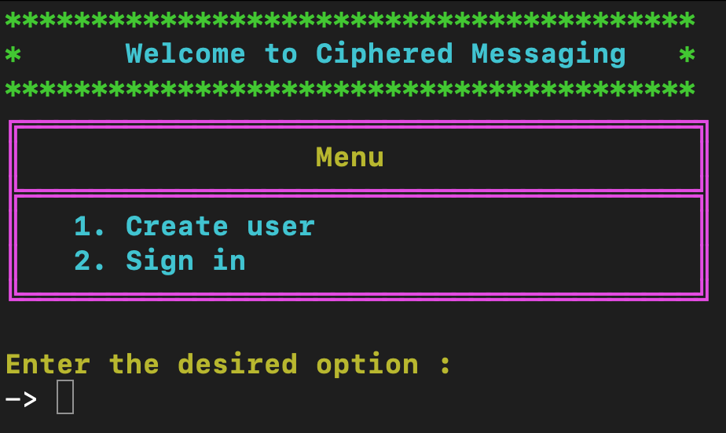
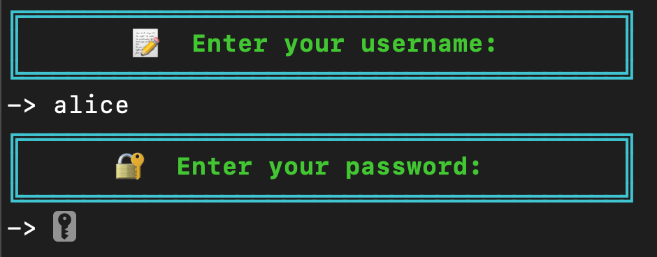
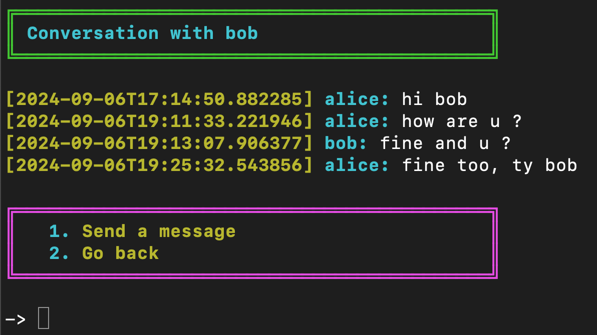

# Encrypted Messaging using Asymmetric Encryption (RSA)

## 1. What is the aim of the project?

The aim of this project is to learn asymmetric encryption by creating an encrypted messaging program in a terminal with Python with the following constraints:
- No use of a crypto library
- No storage of clear passwords or private keys

The features of the program are:
- Create a user and sign in
- Send a message to a user
- Create and view conversations with other users

There are probably many better ways to create this program than mine, but this one was the most obvious to me.

## 2. How to try it in 5 minutes?
- Download the repository from [this address](https://github.com/julien-clnn/cipher_messaging.git).
- Open your terminal.
- (Optional) Download Python if you don't already have it with this command: ```pip install python```
- Navigate to the project folder, for example: ```cd /Downloads/cipherCommunication```
- Launch the program: ```python main.py```
- Enjoy the program! You can use existing users like _alice_ (password: _alice_) and _bob_ (password: _bob_) if you want.
- You can use ```CTRL + C``` to close the program.

## 3. How does it work?

### 3.1. User Management

When the program is launched, the user can create an account or log in. When a user is created, a _users.json_ file stores:
- Its username
- The SHA256 hash of its password
- Its 1024-bit public key

When the user tries to connect, the program will compare the hash of the entered password with the hash of the stored password.




### 3.2. Conversation Encryption

Each user has a public key and a private key. The public key is stored in _users.json_, but the private key is generated each time we need it (to display conversations) using a seed (username + clear_password). Using this method, the user only needs to remember their password and the program doesn't need to store the private key.

To cipher a message using asymmetric encryption, the user will encrypt their message using the public key of the user they want to send the message to. Then, the other user will use their private key to decrypt the message. The image below (from the website [SS2BUY](https://www.ssl2buy.com/wiki/symmetric-vs-asymmetric-encryption-what-are-differences)) explains this principle graphically.


The cryptosystem used to encrypt the messages and to generate the keys is [RSA](https://en.wikipedia.org/wiki/RSA_(cryptosystem)).

The loading page is a simple application of [Python Threading](https://docs.python.org/3/library/threading.html).

A problem I encountered was displaying conversations if the message was encrypted with the public key of the other user. To fix that, I chose to encrypt the messages with the public key of the sender and the public key of the recipient. So the conversation will be decrypted with the private key of the user logged in.



## 4. Review and Potential Improvements

- The total amount of time spent on this project is around 5 days.
- The project idea comes from a scholarly project in the Cryptography class at the University of Technology of Troyes.
- To simplify user interaction, the program creates the keys with a seed composed of the SHA256 hash of the user's password. This means that the confidentiality of conversations is only based on the security of the [SHA256](https://en.wikipedia.org/wiki/SHA-2) algorithm, which is not as secure as RSA.
- This is a learning project about cryptography, so it is not optimized to be used by many people. The program can only be launched locally.
- Conversations between two users are only using the same private keys. So if one key is compromised, the entire conversation loses its confidentiality. A way to avoid this problem could be the use of [Key Derivation Function and Double Ratchet Algorithm](https://en.wikipedia.org/wiki/Double_Ratchet_Algorithm), but it will be for the next version.

## 5. Collaborators

Some functions from the files above are reused from a previous university project done in 2023 with [Maxence Jaulin](https://github.com/maxencejaulin):
- generate_prime_number.py
- rsa_management.py
- hash_with_sha256.py
